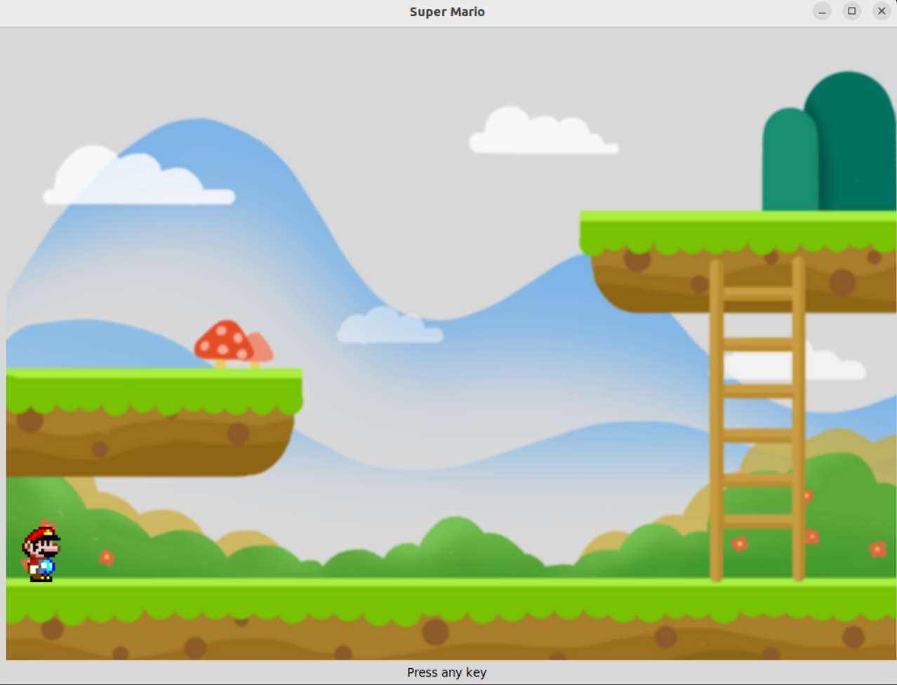

# Super Mario in Tcl/Tk

Just a simple implementation of super mario in tcl/tk, no fancy stuff here because tcl is F* up in game development, but can give you a simple taste of events and some rendering stuff in Tcl/Tk, got encouraged from the pacman implementation in Tcl/Tk.

<p align="center">
  
</p>

## How to Run?
```bash
  tclsh a.tcl
```
or you can use wish
```bash
  wish a.tcl
```


## Authors

- [@Basheer Rjoub](https://www.github.com/basheerrjoub)


